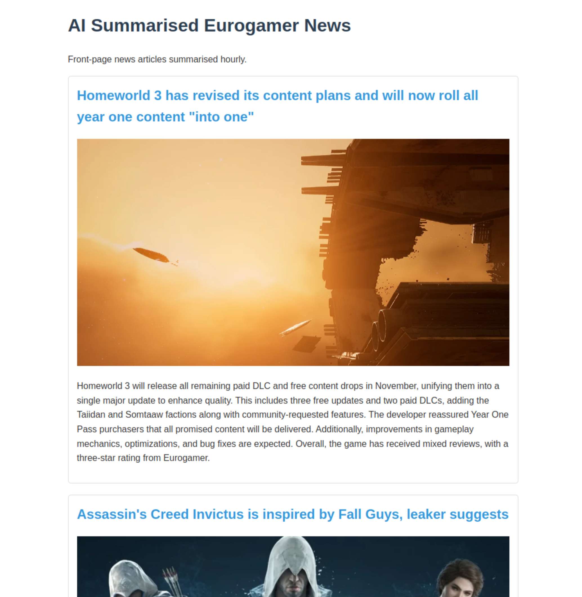

# Gaming News AI Summariser

A website built with FastHTML to parse Eurogamer's RSS feed and summarise the most recent news.

### Installation

I've used UV to manage dependencies:

Make a venv:
`uv venv`

Activate with:
`source .venv/bin/activate`

Sync with lock file:
`uv sync`

Set your OpenAI env variable:
`export OPENAI_API_KEY=your_key_here`

Run main.py:
`python main.py`

View page locally at localhost:5001
